<!-- README.md is generated from README.Rmd. Please edit that file -->

# A `ggplot2` and `gganimate` Version of Pac-Man 

<!-- badges: start -->

[](https://www.tidyverse.org/lifecycle/#maturing)
[](https://github.com/mcanouil/ggpacman)
[](https://github.com/mcanouil/ggpacman/actions)
[](https://CRAN.R-project.org/package=ggpacman)
<!-- badges: end -->

The goal of `ggpacman` is to …  
Make a GIF of the game Pac-Man (*not to develop an R version of Pac-Man
…*).

## Installation

``` r
# Install ggpacman from CRAN:
install.packages("ggpacman")

# Or the the development version from GitHub:
# install.packages("remotes")
remotes::install_github("mcanouil/ggpacman")
```

## Pac-Man in action

``` r
library(ggpacman)
animate_pacman(
  pacman = pacman,
  ghosts = list(blinky, pinky, inky, clyde),
  font_family = "xkcd"
)
```

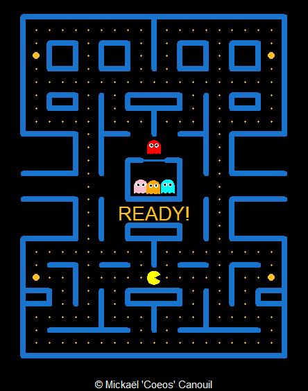<!-- -->

## The Story of `ggpacman`

It started on a Saturday evening …

It was the 21<sup>st</sup> of March (*for the sake of precision*),
around 10 pm CET (*also for the sake of precision and mostly because it
is not relevant*). I was playing around with my data on ‘all’ the movies
I have seen so far
([mcanouil/IMDbRating](https://github.com/mcanouil/IMDbRating)) and
looking on possibly new ideas of visualisation on twitter using
`#ggplot2` and `#gganimate` (by the way the first time I played with
[`gganimate`](https://gganimate.com/) was at [useR-2018 (Brisbane,
Australia)](https://www.r-project.org/conferences/useR-2018/), just
before and when @thomasp85 released the actual framework). The only
thing on the feed was “contaminated/deaths and covid-19” curves made
with [`ggplot2`](https://ggplot2.tidyverse.org/) and a few with
[`gganimate`](https://gganimate.com/) … Let’s say, it was not as funny
and interesting as I was hoping for … Then, I’ve got an idea, what if I
can do something funny and not expected with
[`ggplot2`](https://ggplot2.tidyverse.org/) and
[`gganimate`](https://gganimate.com/)? My first thought, was let’s draw
and animate Pac-Man, that should not be that hard!

Well, it was not that easy after-all … But, I am going to go through my
code here (you might be interested to actually look at the [commits
history](https://github.com/mcanouil/ggpacman/commits/master).

<blockquote class="twitter-tweet">
<p lang="en" dir="ltr">
Maybe I went too far with
<a href="https://twitter.com/hashtag/ggplot2?src=hash&amp;ref_src=twsrc%5Etfw">\#ggplot2</a>
and
<a href="https://twitter.com/hashtag/gganimate?src=hash&amp;ref_src=twsrc%5Etfw">\#gganimate</a>
…😅<br>What do you think
<a href="https://twitter.com/hadleywickham?ref_src=twsrc%5Etfw">@hadleywickham</a>
&
<a href="https://twitter.com/thomasp85?ref_src=twsrc%5Etfw">@thomasp85</a>
, did I go too far or not enough ? (I am planning to add the ghosts 😎)
<a href="https://t.co/nkfbti1Etd">pic.twitter.com/nkfbti1Etd</a>
</p>
— Mickaël CANOUIL (@mickaelcanouil)
<a href="https://twitter.com/mickaelcanouil/status/1241760925499170824?ref_src=twsrc%5Etfw">March
22, 2020</a>
</blockquote>

1.  [The packages](#the-packages)
2.  [The maze layer](#the-maze-layer)
    1.  [The base layer](#the-base-layer)
    2.  [The grid layer](#the-grid-layer)
    3.  [The bonus points layer](#the-bonus-points-layer)
3.  [Pac-Man character](#pac-man-character)
4.  [The Ghosts characters](#the-ghosts-characters)
    1.  [Body](#body)
    2.  [Eyes](#eyes)
    3.  [Ghost shape](#ghost-shape)
5.  [How Pac-Man interacts with the
    maze?](#how-pac-man-interacts-with-the-maze)
    1.  [Bonus points](#bonus-points)
    2.  [Ghost `"weak"` and `"eaten"`
        states](#ghost-weak-and-eaten-states)
6.  [Plot time](#Plot-time-to-summarise-a-little-or-a-lot)

### The packages

``` r
library("stats")
library("utils")
library("rlang")
library("magrittr")
library("dplyr")
library("tidyr")
library("purrr")
library("ggplot2")
library("ggforce")
library("gganimate")
library("ggtext")
```

### The maze layer

#### The base layer

First thing first, I needed to set-up the base layer, meaning, the maze
from Pac-Man. I did start by setting the coordinates of the maze.

``` r
base_layer <- ggplot() +
  theme_void() +
  theme(
    legend.position = "none",
    plot.background = element_rect(fill = "black", colour = "black"),
    panel.background = element_rect(fill = "black", colour = "black"),
  ) +
  coord_fixed(xlim = c(0, 20), ylim = c(0, 26))
```

For later use, I defined some scales (actually those scales, where
defined way after chronologically speaking). I am using those to define
sizes and colours for all the geometries I am going to use to achieve
the Pac-Man GIF.

``` r
map_colours <- c(
  "READY!" = "goldenrod1",
  "wall" = "dodgerblue3", "door" = "dodgerblue3",
  "normal" = "goldenrod1", "big" = "goldenrod1", "eaten" = "black",
  "Pac-Man" = "yellow",
  "eye" = "white", "iris" = "black",
  "Blinky" = "red", "Blinky_weak" = "blue", "Blinky_eaten" = "transparent",
  "Pinky" = "pink", "Pinky_weak" = "blue", "Pinky_eaten" = "transparent",
  "Inky" = "cyan", "Inky_weak" = "blue", "Inky_eaten" = "transparent",
  "Clyde" = "orange", "Clyde_weak" = "blue", "Clyde_eaten" = "transparent"
)
```

``` r
base_layer <- base_layer +
  scale_size_manual(values = c("wall" = 2.5, "door" = 1, "big" = 2.5, "normal" = 0.5, "eaten" = 3)) +
  scale_fill_manual(breaks = names(map_colours), values = map_colours) +
  scale_colour_manual(breaks = names(map_colours), values = map_colours)
```

<!-- -->

My `base_layer` here is not really helpful, so I temporarily added some
elements to help me draw everything on it. *Note*: I won’t use it in the
following.

``` r
base_layer +
  scale_x_continuous(breaks = 0:21, sec.axis = dup_axis()) +
  scale_y_continuous(breaks = 0:26, sec.axis = dup_axis()) +
  theme(
    panel.grid.major = element_line(colour = "white"),
    axis.text = element_text(colour = "white")
  ) +
  annotate("rect", xmin = 0, xmax = 21, ymin = 0, ymax = 26, fill = NA)
```

<!-- -->

Quite better, isn’t it?!

#### The grid layer

Here, I am calling “grid”, the walls of the maze. For this grid, I
started drawing the vertical lines on the left side of the maze (as you
may have noticed, the first level is symmetrical).

``` r
left_vertical_segments <- tribble(
  ~x, ~y, ~xend, ~yend,
  0, 0, 0, 9,
  0, 17, 0, 26,
  2, 4, 2, 5,
  2, 19, 2, 20,
  2, 22, 2, 24,
  4, 4, 4, 7,
  4, 9, 4, 12,
  4, 14, 4, 17,
  4, 19, 4, 20,
  4, 22, 4, 24,
  6, 2, 6, 5,
  6, 9, 6, 12,
  6, 14, 6, 20,
  6, 22, 6, 24,
  8, 4, 8, 5,
  8, 9, 8, 10,
  8, 12, 8, 15,
  8, 19, 8, 20,
  8, 22, 8, 24
)
```

``` r
base_layer +
  geom_segment(
    data = left_vertical_segments,
    mapping = aes(x = x, y = y, xend = xend, yend = yend),
    lineend = "round",
    inherit.aes = FALSE,
    colour = "white"
  )
```

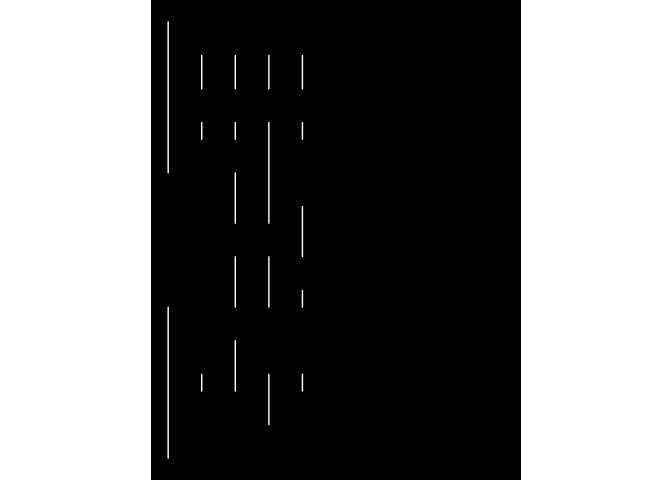<!-- -->

Then, I added the horizontal lines (still only on the left side of the
maze)!

``` r
left_horizontal_segments <- tribble(
  ~x, ~y, ~xend, ~yend,
  0, 0, 10, 0,
  2, 2, 8, 2,
  0, 4, 2, 4,
  8, 4, 10, 4,
  0, 5, 2, 5,
  8, 5, 10, 5,
  2, 7, 4, 7,
  6, 7, 8, 7,
  0, 9, 4, 9,
  8, 9, 10, 9,
  8, 10, 10, 10,
  0, 12, 4, 12,
  8, 12, 10, 12,
  0, 14, 4, 14,
  8, 15, 9, 15,
  0, 17, 4, 17,
  6, 17, 8, 17,
  2, 19, 4, 19,
  8, 19, 10, 19,
  2, 20, 4, 20,
  8, 20, 10, 20,
  2, 22, 4, 22,
  6, 22, 8, 22,
  2, 24, 4, 24,
  6, 24, 8, 24,
  0, 26, 10, 26
)

left_segments <- bind_rows(left_vertical_segments, left_horizontal_segments)
```

``` r
base_layer +
  geom_segment(
    data = left_segments,
    mapping = aes(x = x, y = y, xend = xend, yend = yend),
    lineend = "round",
    inherit.aes = FALSE,
    colour = "white"
  )
```

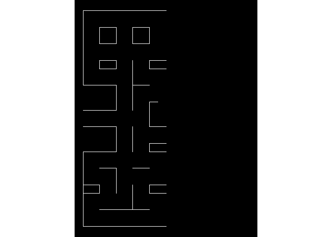<!-- -->

The maze is slowly appearing, but surely. As I wrote earlier, the first
level is symmetrical, so I used my left lines `left_segments` to compute
all the lignes on the right `right_segments`.

``` r
right_segments <-  mutate(
  .data = left_segments,
  x = abs(x - 20),
  xend = abs(xend - 20)
)
```

``` r
base_layer +
  geom_segment(
    data = bind_rows(left_segments, right_segments),
    mapping = aes(x = x, y = y, xend = xend, yend = yend),
    lineend = "round",
    inherit.aes = FALSE,
    colour = "white"
  )
```

<!-- -->

The middle vertical lines were missing, *i.e.*, I did not want to plot
them twice, which would have happen, if I added these in
`left_segments`. Also, the “door” of the ghost spawn area is missing. I
added the door and the missing vertical walls in the end.

``` r
centre_vertical_segments <- tribble(
  ~x, ~y, ~xend, ~yend,
  10, 2, 10, 4,
  10, 7, 10, 9,
  10, 17, 10, 19,
  10, 22, 10, 26
)
door_segment <- tibble(x = 9, y = 15, xend = 11, yend = 15, type = "door")
```

Finally, I combined all the segments and drew them all.

``` r
maze_walls <- bind_rows(
  left_segments,
  centre_vertical_segments,
  right_segments
) %>%
  mutate(type = "wall") %>%
  bind_rows(door_segment)
```

``` r
base_layer +
  geom_segment(
    data = maze_walls,
    mapping = aes(x = x, y = y, xend = xend, yend = yend),
    lineend = "round",
    inherit.aes = FALSE,
    colour = "white"
  )
```

<!-- -->

The maze is now complete, but no-one can actually see the door, since it
appears the same way as the walls. You may have noticed, I added a
column named `type`. `type` can currently hold two values: `"wall"` and
`"door"`. I am going to use `type` as values for two aesthetics, you may
already have guessed which ones. The answer is the `colour` and `size`
aesthetics.

``` r
base_layer +
  geom_segment(
    data = maze_walls,
    mapping = aes(x = x, y = y, xend = xend, yend = yend, colour = type, size = type),
    lineend = "round",
    inherit.aes = FALSE
  )
```

<!-- -->

*Note: `maze_walls` is a dataset of `ggpacman`
(`data("maze_walls", package = "ggpacman")`).*

#### The bonus points layer

The strategy was quite the same as for the grid layer:

-   Setting up the point coordinates for the left side and the middle.
-   Compute the coordinates for the right side.
-   Use a column `type` for the two types of bonus points, *i.e.*,
    `"normal"` and `"big"` (the one who weaken the ghosts).

``` r
bonus_points_coord <- function() {
  left_bonus_points <- tribble(
    ~x, ~y, ~type,
    1, c(1:3, 7:8, 18:22, 24:25), "normal",
    1, c(6, 23), "big",
    2, c(1, 3, 6, 8, 18, 21, 25), "normal",
    3, c(1, 3:6, 8, 18, 21, 25), "normal",
    4, c(1, 3, 8, 18, 21, 25), "normal",
    5, c(1, 3:25), "normal",
    6, c(1, 6, 8, 21, 25), "normal",
    7, c(1, 3:6, 8, 18:21, 25), "normal",
    8, c(1, 3, 6, 8, 18, 21, 25), "normal",
    9, c(1:3, 6:8, 18, 21:25), "normal"
  )

  bind_rows(
    left_bonus_points,
    tribble(
      ~x, ~y, ~type,
      10, c(1, 21), "normal"
    ),
    mutate(left_bonus_points, x = abs(x - 20))
  ) %>%
    unnest("y")
}
maze_points <- bonus_points_coord()
```

``` r
maze_layer <- base_layer +
  geom_segment(
    data = maze_walls,
    mapping = aes(x = x, y = y, xend = xend, yend = yend, colour = type, size = type),
    lineend = "round",
    inherit.aes = FALSE
  ) +
  geom_point(
    data = maze_points,
    mapping = aes(x = x, y = y, size = type, colour = type),
    inherit.aes = FALSE
  )
```

<!-- -->

*Note: `maze_points` is a dataset of `ggpacman`
(`data("maze_points", package = "ggpacman")`).*

### Pac-Man character

It is now time to draw the main character. To draw Pac-Man, I needed few
things:

-   The Pac-Man moves, *i.e.*, all the coordinates where Pac-Man is
    supposed to be at every `step`.

    ``` r
    data("pacman", package = "ggpacman")
    unnest(pacman, c("x", "y"))
    #> # A tibble: 150 x 3
    #>        x     y colour 
    #>    <dbl> <dbl> <chr>  
    #>  1    10     6 Pac-Man
    #>  2    10     6 Pac-Man
    #>  3    10     6 Pac-Man
    #>  4    10     6 Pac-Man
    #>  5    10     6 Pac-Man
    #>  6    10     6 Pac-Man
    #>  7    10     6 Pac-Man
    #>  8    10     6 Pac-Man
    #>  9    10     6 Pac-Man
    #> 10    10     6 Pac-Man
    #> # ... with 140 more rows
    ```

    ``` r
    maze_layer +
      geom_point(
        data = unnest(pacman, c("x", "y")),
        mapping = aes(x = x, y = y, colour = colour),
        size = 4
      )
    ```

    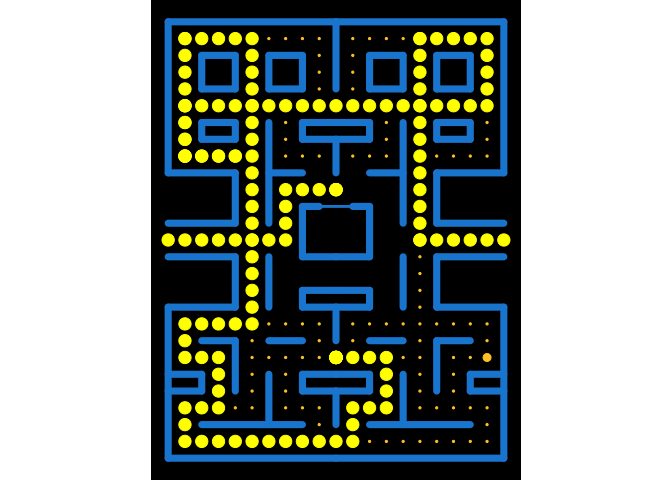<!-- -->

-   The Pac-Man shape (open and closed mouth). Since, Pac-Man is not a
    complete circle shape, I used `geom_arc_bar()` (from
    [`ggforce`](https://ggforce.data-imaginist.com/)), and defined the
    properties of each state of Pac-Man based on the aesthetics required
    by this function. *Note*: At first, I wanted a smooth
    animation/transition of Pac-Man opening and closing its mouth, this
    is why there are four `"close_"` states.

    ``` r
    pacman_state <- tribble(
      ~state, ~start, ~end,
      "open_right", 14 / 6 * pi, 4 / 6 * pi,
      "close_right", 15 / 6 * pi, 3 / 6 * pi,
      "open_up", 11 / 6 * pi, 1 / 6 * pi,
      "close_up", 12 / 3 * pi, 0 / 6 * pi,
      "open_left", 8 / 6 * pi, - 2 / 6 * pi,
      "close_left", 9 / 6 * pi, - 3 / 6 * pi,
      "open_down", 5 / 6 * pi, - 5 / 6 * pi,
      "close_down", pi, - pi
    )
    ```

    ``` r
    ggplot() +
      geom_arc_bar(
        data = pacman_state,
        mapping = aes(x0 = 0, y0 = 0, r0 = 0, r = 0.5, start = start, end = end),
        fill = "yellow",
        inherit.aes = FALSE
      ) +
      facet_wrap(vars(state), ncol = 4)
    ```

    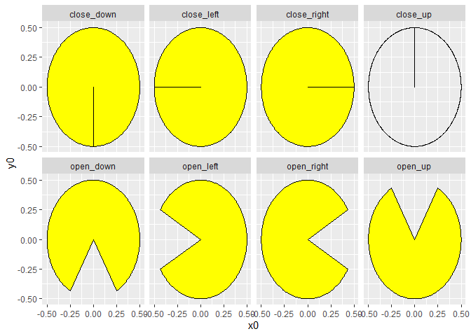<!-- -->

<blockquote class="twitter-tweet">
<p lang="en" dir="ltr">
Next mission, should you choose to accept, is to make Pac-Man face the
direction of movement🎖
</p>
— Thomas Lin Pedersen (@thomasp85)
<a href="https://twitter.com/thomasp85/status/1241767912370774020?ref_src=twsrc%5Etfw">March
22, 2020</a>
</blockquote>

Once those things available, how to make Pac-Man look where he is
headed? Short answer, I just computed the differences between two
successive positions of Pac-Man and added both open/close state to a new
column `state`.

``` r
pacman %>%
  unnest(c("x", "y")) %>%
  mutate(
    state_x = sign(x - lag(x)),
    state_y = sign(y - lag(y)),
    state = case_when(
      (is.na(state_x) | state_x %in% 0) & (is.na(state_y) | state_y %in% 0) ~ list(c("open_right", "close_right")),
      state_x == 1 & state_y == 0 ~ list(c("open_right", "close_right")),
      state_x == -1 & state_y == 0 ~ list(c("open_left", "close_left")),
      state_x == 0 & state_y == -1 ~ list(c("open_down", "close_down")),
      state_x == 0 & state_y == 1 ~ list(c("open_up", "close_up"))
    )
  )  %>%
  unnest("state")
#> # A tibble: 300 x 6
#>        x     y colour  state_x state_y state      
#>    <dbl> <dbl> <chr>     <dbl>   <dbl> <chr>      
#>  1    10     6 Pac-Man      NA      NA open_right 
#>  2    10     6 Pac-Man      NA      NA close_right
#>  3    10     6 Pac-Man       0       0 open_right 
#>  4    10     6 Pac-Man       0       0 close_right
#>  5    10     6 Pac-Man       0       0 open_right 
#>  6    10     6 Pac-Man       0       0 close_right
#>  7    10     6 Pac-Man       0       0 open_right 
#>  8    10     6 Pac-Man       0       0 close_right
#>  9    10     6 Pac-Man       0       0 open_right 
#> 10    10     6 Pac-Man       0       0 close_right
#> # ... with 290 more rows
```

Here, in preparation for [`gganimate`](https://gganimate.com/), I also
added a column `step` before merging the new upgraded `pacman` (*i.e.*,
with the Pac-Man `state` column) with the `pacman_state` defined
earlier.

``` r
pacman_moves <- ggpacman::compute_pacman_coord(pacman)
pacman_moves
#> # A tibble: 300 x 9
#>        x     y colour  state_x state_y state        step start   end
#>    <dbl> <dbl> <chr>     <dbl>   <dbl> <chr>       <int> <dbl> <dbl>
#>  1    10     6 Pac-Man      NA      NA open_right      1  7.33  2.09
#>  2    10     6 Pac-Man      NA      NA close_right     2  7.85  1.57
#>  3    10     6 Pac-Man       0       0 open_right      3  7.33  2.09
#>  4    10     6 Pac-Man       0       0 close_right     4  7.85  1.57
#>  5    10     6 Pac-Man       0       0 open_right      5  7.33  2.09
#>  6    10     6 Pac-Man       0       0 close_right     6  7.85  1.57
#>  7    10     6 Pac-Man       0       0 open_right      7  7.33  2.09
#>  8    10     6 Pac-Man       0       0 close_right     8  7.85  1.57
#>  9    10     6 Pac-Man       0       0 open_right      9  7.33  2.09
#> 10    10     6 Pac-Man       0       0 close_right    10  7.85  1.57
#> # ... with 290 more rows
```

``` r
maze_layer +
  geom_arc_bar(
    data = pacman_moves,
    mapping = aes(x0 = x, y0 = y, r0 = 0, r = 0.5, start = start, end = end, colour = colour, fill = colour, group = step),
    inherit.aes = FALSE
  )
```

<!-- -->

You can’t see much?! Ok, perhaps it’s time to use
[`gganimate`](https://gganimate.com/). I am going to animate Pac-Man
based on the column `step`, which is, if you looked at the code above,
just the line number of `pacman_moves`.

``` r
animated_pacman <- maze_layer +
  geom_arc_bar(
    data = pacman_moves,
    mapping = aes(x0 = x, y0 = y, r0 = 0, r = 0.5, start = start, end = end, colour = colour, fill = colour, group = step),
    inherit.aes = FALSE
  ) +
  transition_manual(step)
```

<!-- -->

*Note: `pacman` is a dataset of `ggpacman`
(`data("pacman", package = "ggpacman")`).*

### The Ghosts characters

Time to draw the ghosts, namely: Blinky, Pinky, Inky and Clyde.

#### Body

I started with the body, especially the top and the bottom part of the
ghost which are half circle (or at least I chose this) and use again
`geom_arc_bar()`.

``` r
ghost_arc <- tribble(
  ~x0, ~y0, ~r, ~start, ~end, ~part,
  0, 0, 0.5, - 1 * pi / 2, 1 * pi / 2, "top",
  -0.5, -0.5 + 1/6, 1 / 6,  pi / 2, 2 * pi / 2, "bottom",
  -1/6, -0.5 + 1/6, 1 / 6,  pi / 2, 3 * pi / 2, "bottom",
  1/6, -0.5 + 1/6, 1 / 6,  pi / 2, 3 * pi / 2, "bottom",
  0.5, -0.5 + 1/6, 1 / 6,  3 * pi / 2,  2 * pi / 2, "bottom"
)
```

``` r
top <- ggplot() +
  geom_arc_bar(
    data = ghost_arc[1, ],
    mapping = aes(x0 = x0, y0 = y0, r0 = 0, r = r, start = start, end = end)
  ) +
  coord_fixed(xlim = c(-1, 1), ylim = c(-1, 1))
```

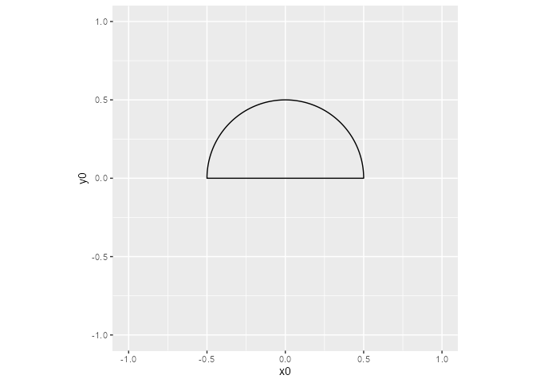<!-- -->

I retrieved the coordinates of the created polygon, using
`ggplot_build()`.

``` r
top_polygon <- ggplot_build(top)$data[[1]][, c("x", "y")]
```

And I proceeded the same way for the bottom part of the ghost.

``` r
bottom <- ggplot() +
  geom_arc_bar(
    data = ghost_arc[-1, ],
        mapping = aes(x0 = x0, y0 = y0, r0 = 0, r = r, start = start, end = end)
  ) +
  coord_fixed(xlim = c(-1, 1), ylim = c(-1, 1))
```

<!-- -->

``` r
bottom_polygon <- ggplot_build(bottom)$data[[1]][, c("x", "y")]
```

Then, I just added one point to “properly” link the top and the bottom
part.

``` r
ghost_body <- dplyr::bind_rows(
  top_polygon,
  dplyr::tribble(
    ~x, ~y,
    0.5, 0,
    0.5, -0.5 + 1/6
  ),
  bottom_polygon,
  dplyr::tribble(
    ~x, ~y,
    -0.5, -0.5 + 1/6,
    -0.5, 0
  )
)
```

I finally got the whole ghost shape I was looking for.

``` r
ggplot() +
  coord_fixed(xlim = c(-1, 1), ylim = c(-1, 1)) +
  geom_polygon(
    data = ghost_body,
    mapping = aes(x = x, y = y),
    inherit.aes = FALSE
  )
```

<!-- -->

*Note: `ghost_body` is a dataset of `ggpacman`
(`data("ghost_body", package = "ggpacman")`).* *Note: `ghost_body`
definitely needs some code refactoring.*

#### Eyes

The eyes are quite easy to draw, they are just circles, but … As for
Pac-Man before, I wanted the ghosts to look where they are headed. This
implies moving the iris one way or the other, and so I defined five
states for the iris: right, down, left, up and middle.

``` r
ghost_eyes <- tribble(
  ~x0, ~y0, ~r, ~part, ~direction,
  1/5, 1/8, 1/8, "eye", c("up", "down", "right", "left", "middle"),
  -1/5, 1/8, 1/8, "eye", c("up", "down", "right", "left", "middle"),
  5/20, 1/8, 1/20, "iris", "right",
  -3/20, 1/8, 1/20, "iris", "right",
  1/5, 1/16, 1/20, "iris", "down",
  -1/5, 1/16, 1/20, "iris", "down",
  3/20, 1/8, 1/20, "iris", "left",
  -5/20, 1/8, 1/20, "iris", "left",
  1/5, 3/16, 1/20, "iris", "up",
  -1/5, 3/16, 1/20, "iris", "up",
  1/5, 1/8, 1/20, "iris", "middle",
  -1/5, 1/8, 1/20, "iris", "middle"
) %>%
  unnest("direction")
```

``` r
map_eyes <- c("eye" = "white", "iris" = "black")
ggplot() +
  coord_fixed(xlim = c(-0.5, 0.5), ylim = c(-0.5, 0.5)) +
  scale_fill_manual(breaks = names(map_eyes), values = map_eyes) +
  scale_colour_manual(breaks = names(map_eyes), values = map_eyes) +
  geom_circle(
    data = ghost_eyes,
    mapping = aes(x0 = x0, y0 = y0, r = r, colour = part, fill = part),
    inherit.aes = FALSE,
    show.legend = FALSE
  ) +
  facet_wrap(vars(direction), ncol = 3)
```

<!-- -->

*Note: `ghost_eyes` is a dataset of `ggpacman`
(`data("ghost_eyes", package = "ggpacman")`).*

#### Ghost shape

I had the whole ghost shape and the eyes.

``` r
ggplot() +
  coord_fixed(xlim = c(-1, 1), ylim = c(-1, 1)) +
  scale_fill_manual(breaks = names(map_colours), values = map_colours) +
  scale_colour_manual(breaks = names(map_colours), values = map_colours) +
  geom_polygon(
    data = get(data("ghost_body", package = "ggpacman")),
    mapping = aes(x = x, y = y),
    inherit.aes = FALSE
  ) +
  geom_circle(
    data = get(data("ghost_eyes", package = "ggpacman")),
    mapping = aes(x0 = x0, y0 = y0, r = r, colour = part, fill = part),
    inherit.aes = FALSE,
    show.legend = FALSE
  ) +
  facet_wrap(vars(direction), ncol = 3)
```

<!-- -->

Again, same as for Pac-Man, in order to know where the ghosts are
supposed to look, I computed the differences of each successive
positions of the ghosts and I added the corresponding directions.

``` r
blinky_ghost <- tibble(x = c(0, 1, 1, 0, 0), y = c(0, 0, 1, 1, 0), colour = "Blinky") %>%
  unnest(c("x", "y")) %>%
  mutate(
    X0 = x,
    Y0 = y,
    state_x = sign(round(x) - lag(round(x))),
    state_y = sign(round(y) - lag(round(y))),
    direction = case_when(
      (is.na(state_x) | state_x %in% 0) & (is.na(state_y) | state_y %in% 0) ~ "middle",
      state_x == 1 & state_y == 0 ~ "right",
      state_x == -1 & state_y == 0 ~ "left",
      state_x == 0 & state_y == -1 ~ "down",
      state_x == 0 & state_y == 1 ~ "up"
    )
  ) %>%
  unnest("direction")
```

    #> # A tibble: 5 x 8
    #>       x     y colour    X0    Y0 state_x state_y direction
    #>   <dbl> <dbl> <chr>  <dbl> <dbl>   <dbl>   <dbl> <chr>    
    #> 1     0     0 Blinky     0     0      NA      NA middle   
    #> 2     1     0 Blinky     1     0       1       0 right    
    #> 3     1     1 Blinky     1     1       0       1 up       
    #> 4     0     1 Blinky     0     1      -1       0 left     
    #> 5     0     0 Blinky     0     0       0      -1 down

I also added some noise around the position, *i.e.*, four noised
position at each actual position of a ghost.

``` r
blinky_ghost <- blinky_ghost %>%
  mutate(state = list(1:4)) %>%
  unnest("state") %>%
  mutate(
    step = 1:n(),
    noise_x = rnorm(n(), mean = 0, sd = 0.05),
    noise_y = rnorm(n(), mean = 0, sd = 0.05)
  )
```

    #> # A tibble: 20 x 12
    #>        x     y colour    X0    Y0 state_x state_y direction state  step  noise_x
    #>    <dbl> <dbl> <chr>  <dbl> <dbl>   <dbl>   <dbl> <chr>     <int> <int>    <dbl>
    #>  1     0     0 Blinky     0     0      NA      NA middle        1     1  0.113  
    #>  2     0     0 Blinky     0     0      NA      NA middle        2     2  0.0208 
    #>  3     0     0 Blinky     0     0      NA      NA middle        3     3  0.00144
    #>  4     0     0 Blinky     0     0      NA      NA middle        4     4  0.0478 
    #>  5     1     0 Blinky     1     0       1       0 right         1     5 -0.0466 
    #>  6     1     0 Blinky     1     0       1       0 right         2     6 -0.0384 
    #>  7     1     0 Blinky     1     0       1       0 right         3     7 -0.0234 
    #>  8     1     0 Blinky     1     0       1       0 right         4     8 -0.0579 
    #>  9     1     1 Blinky     1     1       0       1 up            1     9  0.0457 
    #> 10     1     1 Blinky     1     1       0       1 up            2    10 -0.0381 
    #> 11     1     1 Blinky     1     1       0       1 up            3    11  0.0442 
    #> 12     1     1 Blinky     1     1       0       1 up            4    12  0.0252 
    #> 13     0     1 Blinky     0     1      -1       0 left          1    13  0.0539 
    #> 14     0     1 Blinky     0     1      -1       0 left          2    14 -0.0788 
    #> 15     0     1 Blinky     0     1      -1       0 left          3    15  0.0748 
    #> 16     0     1 Blinky     0     1      -1       0 left          4    16  0.00495
    #> 17     0     0 Blinky     0     0       0      -1 down          1    17 -0.0176 
    #> 18     0     0 Blinky     0     0       0      -1 down          2    18 -0.0624 
    #> 19     0     0 Blinky     0     0       0      -1 down          3    19 -0.0282 
    #> 20     0     0 Blinky     0     0       0      -1 down          4    20  0.00918
    #> # ... with 1 more variable: noise_y <dbl>

Then, I added (*in a weird way I might say*) the polygons coordinates
for the body and the eyes.

``` r
blinky_ghost <- blinky_ghost %>%
  mutate(
    body = pmap(
      .l = list(x, y, noise_x, noise_y),
      .f = function(.x, .y, .noise_x, .noise_y) {
        mutate(
          .data = get(data("ghost_body")),
          x = x + .x + .noise_x,
          y = y + .y + .noise_y
        )
      }
    ),
    eyes = pmap(
      .l = list(x, y, noise_x, noise_y, direction),
      .f = function(.x, .y, .noise_x, .noise_y, .direction) {
        mutate(
          .data = filter(get(data("ghost_eyes")), direction == .direction),
          x0 = x0 + .x + .noise_x,
          y0 = y0 + .y + .noise_y,
          direction = NULL
        )
      }
    ),
    x = NULL,
    y = NULL
  )
```

    #> # A tibble: 20 x 12
    #>    colour    X0    Y0 state_x state_y direction state  step  noise_x   noise_y
    #>    <chr>  <dbl> <dbl>   <dbl>   <dbl> <chr>     <int> <int>    <dbl>     <dbl>
    #>  1 Blinky     0     0      NA      NA middle        1     1  0.113   -0.0146  
    #>  2 Blinky     0     0      NA      NA middle        2     2  0.0208  -0.0619  
    #>  3 Blinky     0     0      NA      NA middle        3     3  0.00144  0.0522  
    #>  4 Blinky     0     0      NA      NA middle        4     4  0.0478  -0.0322  
    #>  5 Blinky     1     0       1       0 right         1     5 -0.0466   0.0664  
    #>  6 Blinky     1     0       1       0 right         2     6 -0.0384   0.000439
    #>  7 Blinky     1     0       1       0 right         3     7 -0.0234   0.0402  
    #>  8 Blinky     1     0       1       0 right         4     8 -0.0579   0.00348 
    #>  9 Blinky     1     1       0       1 up            1     9  0.0457   0.0239  
    #> 10 Blinky     1     1       0       1 up            2    10 -0.0381   0.0248  
    #> 11 Blinky     1     1       0       1 up            3    11  0.0442  -0.0259  
    #> 12 Blinky     1     1       0       1 up            4    12  0.0252  -0.0186  
    #> 13 Blinky     0     1      -1       0 left          1    13  0.0539  -0.000861
    #> 14 Blinky     0     1      -1       0 left          2    14 -0.0788  -0.0147  
    #> 15 Blinky     0     1      -1       0 left          3    15  0.0748  -0.0107  
    #> 16 Blinky     0     1      -1       0 left          4    16  0.00495 -0.0526  
    #> 17 Blinky     0     0       0      -1 down          1    17 -0.0176  -0.00330 
    #> 18 Blinky     0     0       0      -1 down          2    18 -0.0624   0.00533 
    #> 19 Blinky     0     0       0      -1 down          3    19 -0.0282   0.0662  
    #> 20 Blinky     0     0       0      -1 down          4    20  0.00918  0.0151  
    #> # ... with 2 more variables: body <list>, eyes <list>

For ease, it is now a call to one function directly on the poition
matrix of a ghost.

``` r
blinky_ghost <- tibble(x = c(0, 1, 1, 0, 0), y = c(0, 0, 1, 1, 0), colour = "Blinky")
blinky_moves <- ggpacman::compute_ghost_coord(blinky_ghost)
```

``` r
blinky_plot <- base_layer +
  coord_fixed(xlim = c(-1, 2), ylim = c(-1, 2)) +
  geom_polygon(
    data = unnest(blinky_moves, "body"),
    mapping = aes(x = x, y = y, fill = colour, colour = colour, group = step),
    inherit.aes = FALSE
  ) +
  geom_circle(
    data = unnest(blinky_moves, "eyes"),
    mapping = aes(x0 = x0, y0 = y0, r = r, colour = part, fill = part, group = step),
    inherit.aes = FALSE
  )
```

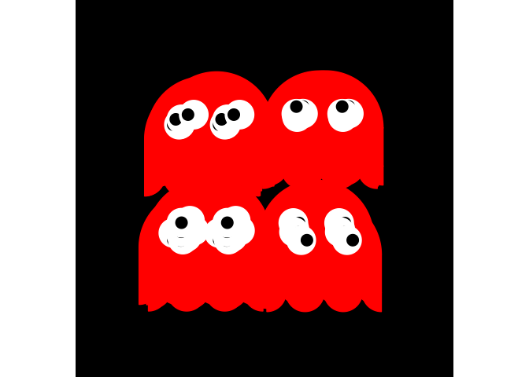<!-- -->

Again, it is better with an animated GIF.

``` r
animated_blinky <- blinky_plot + transition_manual(step)
```

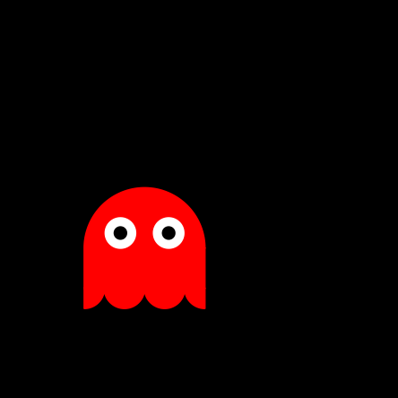<!-- -->

### How Pac-Man interacts with the maze?

#### Bonus points

For ease, I am using some functions I defined to go quickly to the
results of the first part of this readme. The idea here is to look at
all the position in common between Pac-Man (`pacman_moves`) and the
bonus points (`maze_points`). Each time Pac-Man was at the same place as
a bonus point, I defined a status `"eaten"` for all values of `step`
after. I ended up with a big table with position and the state of the
bonus points.

``` r
pacman_moves <- ggpacman::compute_pacman_coord(get(data("pacman", package = "ggpacman")))
right_join(get(data("maze_points")), pacman_moves, by = c("x", "y")) %>%
  distinct(step, x, y, type) %>%
  mutate(
    step = map2(step, max(step), ~ seq(.x, .y, 1)),
    colour = "eaten"
  ) %>%
  unnest("step")
#> # A tibble: 45,150 x 5
#>        x     y type    step colour
#>    <dbl> <dbl> <chr>  <dbl> <chr> 
#>  1     1     1 normal    61 eaten 
#>  2     1     1 normal    62 eaten 
#>  3     1     1 normal    63 eaten 
#>  4     1     1 normal    64 eaten 
#>  5     1     1 normal    65 eaten 
#>  6     1     1 normal    66 eaten 
#>  7     1     1 normal    67 eaten 
#>  8     1     1 normal    68 eaten 
#>  9     1     1 normal    69 eaten 
#> 10     1     1 normal    70 eaten 
#> # ... with 45,140 more rows
```

Again, for ease, I am using a function I defined to compute everything.

``` r
pacman_moves <- ggpacman::compute_pacman_coord(get(data("pacman", package = "ggpacman")))
bonus_points_eaten <- ggpacman::compute_points_eaten(get(data("maze_points")), pacman_moves)
```

If you don’t recall, `maze_layer` already includes a geometry with the
bonus points.

<!-- -->

I could have change this geometry (*i.e.*, `geom_point()`), but I did
not, and draw a new geometry on top of the previous ones. Do you
remember the values of the scale for the size aesthetic?

``` r
scale_size_manual(values = c("wall" = 2.5, "door" = 1, "big" = 2.5, "normal" = 0.5, "eaten" = 3))
```

``` r
maze_layer_points <- maze_layer +
  geom_point(
    data = bonus_points_eaten,
    mapping = aes(x = x, y = y, colour = colour, size = colour, group = step),
    inherit.aes = FALSE
  )
```

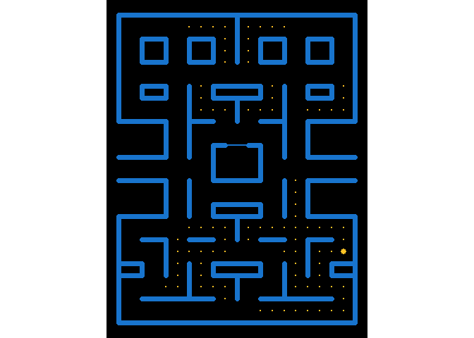<!-- -->

A new animation to see, how the new geometry is overlpping the previous
one as `step` increases.

``` r
animated_points <- maze_layer_points + transition_manual(step)
```

<!-- -->

#### Ghost `"weak"` and `"eaten"` states

The ghosts were more tricky (I know, they are ghosts …).

I first retrieved all the positions wereh a `"big"` bonus point was
eaten by Pac-Man.

``` r
ghosts_vulnerability <- bonus_points_eaten %>%
  filter(type == "big") %>%
  group_by(x, y) %>%
  summarise(step_init = min(step)) %>%
  ungroup() %>%
  mutate(
    step = map(step_init, ~ seq(.x, .x + 30, 1)),
    vulnerability = TRUE,
    x = NULL,
    y = NULL
  ) %>%
  unnest("step")
```

    #> # A tibble: 93 x 3
    #>    step_init  step vulnerability
    #>        <dbl> <dbl> <lgl>        
    #>  1        79    79 TRUE         
    #>  2        79    80 TRUE         
    #>  3        79    81 TRUE         
    #>  4        79    82 TRUE         
    #>  5        79    83 TRUE         
    #>  6        79    84 TRUE         
    #>  7        79    85 TRUE         
    #>  8        79    86 TRUE         
    #>  9        79    87 TRUE         
    #> 10        79    88 TRUE         
    #> # ... with 83 more rows

This is part of a bigger function (I won’t dive too deep into it).

``` r
ggpacman::compute_ghost_status
#> function (ghost, pacman_moves, bonus_points_eaten) 
#> {
#>     ghosts_vulnerability <- bonus_points_eaten %>% dplyr::filter(.data[["type"]] == 
#>         "big") %>% dplyr::group_by(.data[["x"]], .data[["y"]]) %>% 
#>         dplyr::summarise(step_init = min(.data[["step"]])) %>% 
#>         dplyr::ungroup() %>% dplyr::mutate(step = purrr::map(.data[["step_init"]], 
#>         ~seq(.x, .x + 30, 1)), vulnerability = TRUE, x = NULL, 
#>         y = NULL) %>% tidyr::unnest("step")
#>     ghost_out <- dplyr::left_join(x = compute_ghost_coord(ghost), 
#>         y = pacman_moves %>% dplyr::mutate(ghost_eaten = TRUE) %>% 
#>             dplyr::select(c(X0 = "x", Y0 = "y", "step", "ghost_eaten")), 
#>         by = c("X0", "Y0", "step")) %>% dplyr::left_join(y = ghosts_vulnerability, 
#>         by = "step") %>% dplyr::mutate(vulnerability = tidyr::replace_na(.data[["vulnerability"]], 
#>         FALSE), ghost_name = .data[["colour"]], ghost_eaten = .data[["ghost_eaten"]] & 
#>         .data[["vulnerability"]], colour = ifelse(.data[["vulnerability"]], 
#>         paste0(.data[["ghost_name"]], "_weak"), .data[["colour"]]))
#>     pos_eaten_start <- which(ghost_out[["ghost_eaten"]])
#>     ghosts_home <- which(ghost_out[["X0"]] == 10 & ghost_out[["Y0"]] == 
#>         14)
#>     for (ipos in pos_eaten_start) {
#>         pos_eaten_end <- min(ghosts_home[ghosts_home >= ipos])
#>         ghost_out[["colour"]][ipos:pos_eaten_end] <- paste0(unique(ghost_out[["ghost_name"]]), 
#>             "_eaten")
#>     }
#>     dplyr::left_join(x = ghost_out, y = ghost_out %>% dplyr::filter(.data[["step"]] == 
#>         .data[["step_init"]] & grepl("eaten", .data[["colour"]])) %>% 
#>         dplyr::mutate(already_eaten = TRUE) %>% dplyr::select(c("step_init", 
#>         "already_eaten")), by = "step_init") %>% dplyr::mutate(colour = dplyr::case_when(.data[["already_eaten"]] & 
#>         .data[["X0"]] == 10 & .data[["Y0"]] == 14 ~ paste0(.data[["ghost_name"]], 
#>         "_eaten"), grepl("weak", .data[["colour"]]) & .data[["already_eaten"]] ~ 
#>         .data[["ghost_name"]], TRUE ~ .data[["colour"]]))
#> }
#> <bytecode: 0x00000000187ed570>
#> <environment: namespace:ggpacman>
```

The goal of this function, is to compute the different states of a
ghost, according to the bonus points eaten and, of course, the current
Pac-Man position at a determined `step`.

``` r
pacman_moves <- ggpacman::compute_pacman_coord(get(data("pacman", package = "ggpacman")))
bonus_points_eaten <- ggpacman::compute_points_eaten(get(data("maze_points")), pacman_moves)
ghost_moves <- ggpacman::compute_ghost_status(
  ghost = get(data("blinky", package = "ggpacman")),
  pacman_moves = pacman_moves,
  bonus_points_eaten = bonus_points_eaten
)
ghost_moves %>%
  filter(state == 1) %>%
  distinct(step, direction, colour, vulnerability) %>%
  as.data.frame()
#>          colour direction step vulnerability
#> 1        Blinky    middle    1         FALSE
#> 2        Blinky    middle    5         FALSE
#> 3        Blinky    middle    9         FALSE
#> 4        Blinky    middle   13         FALSE
#> 5        Blinky    middle   17         FALSE
#> 6        Blinky    middle   21         FALSE
#> 7        Blinky    middle   25         FALSE
#> 8        Blinky    middle   29         FALSE
#> 9        Blinky    middle   33         FALSE
#> 10       Blinky      left   37         FALSE
#> 11       Blinky      left   41         FALSE
#> 12       Blinky      left   45         FALSE
#> 13       Blinky      down   49         FALSE
#> 14       Blinky      down   53         FALSE
#> 15       Blinky      down   57         FALSE
#> 16       Blinky      left   61         FALSE
#> 17       Blinky      left   65         FALSE
#> 18       Blinky      down   69         FALSE
#> 19       Blinky      down   73         FALSE
#> 20       Blinky      down   77         FALSE
#> 21  Blinky_weak      down   81          TRUE
#> 22  Blinky_weak      down   85          TRUE
#> 23 Blinky_eaten      left   89          TRUE
#> 24 Blinky_eaten     right   93          TRUE
#> 25 Blinky_eaten    middle   97          TRUE
#> 26 Blinky_eaten    middle  101          TRUE
#> 27 Blinky_eaten     right  105          TRUE
#> 28 Blinky_eaten        up  109          TRUE
#> 29 Blinky_eaten     right  113         FALSE
#> 30 Blinky_eaten        up  117         FALSE
#> 31 Blinky_eaten     right  121         FALSE
#> 32 Blinky_eaten        up  125         FALSE
#> 33 Blinky_eaten     right  129         FALSE
#> 34 Blinky_eaten        up  133         FALSE
#> 35 Blinky_eaten     right  137         FALSE
#> 36 Blinky_eaten        up  141          TRUE
#> 37 Blinky_eaten        up  145          TRUE
#> 38 Blinky_eaten    middle  149          TRUE
#> 39 Blinky_eaten    middle  153          TRUE
#> 40 Blinky_eaten    middle  157          TRUE
#> 41       Blinky        up  161          TRUE
#> 42       Blinky        up  165          TRUE
#> 43       Blinky     right  169          TRUE
#> 44       Blinky     right  173         FALSE
#> 45       Blinky     right  177         FALSE
#> 46       Blinky      down  181         FALSE
#> 47       Blinky      down  185         FALSE
#> 48       Blinky      down  189         FALSE
#> 49       Blinky      down  193         FALSE
#> 50       Blinky      down  197         FALSE
#> 51       Blinky      down  201         FALSE
#> 52       Blinky      down  205         FALSE
#> 53       Blinky      down  209         FALSE
#> 54       Blinky      left  213         FALSE
#> 55  Blinky_weak      left  217          TRUE
#> 56  Blinky_weak      down  221          TRUE
#> 57  Blinky_weak      down  225          TRUE
#> 58  Blinky_weak     right  229          TRUE
#> 59  Blinky_weak     right  233          TRUE
#> 60  Blinky_weak     right  237          TRUE
#> 61  Blinky_weak     right  241          TRUE
#> 62  Blinky_weak    middle  245          TRUE
#> 63       Blinky      down  249         FALSE
#> 64       Blinky      down  253         FALSE
#> 65       Blinky      down  257         FALSE
#> 66       Blinky     right  261         FALSE
#> 67       Blinky     right  265         FALSE
#> 68       Blinky        up  269         FALSE
#> 69       Blinky        up  273         FALSE
#> 70       Blinky        up  277         FALSE
#> 71       Blinky    middle  281         FALSE
#> 72       Blinky     right  285         FALSE
#> 73       Blinky     right  289         FALSE
#> 74       Blinky        up  293         FALSE
#> 75       Blinky        up  297         FALSE
```

To simplify a little, below a small example of a ghost moving in one
direction with predetermined states.

``` r
blinky_ghost <- bind_rows(
  tibble(x = 1:4, y = 0, colour = "Blinky"),
  tibble(x = 5:8, y = 0, colour = "Blinky_weak"),
  tibble(x = 9:12, y = 0, colour = "Blinky_eaten")
)
blinky_moves <- ggpacman::compute_ghost_coord(blinky_ghost)
```

    #> # A tibble: 48 x 12
    #>    colour    X0    Y0 state_x state_y direction state  step  noise_x  noise_y
    #>    <chr>  <int> <dbl>   <dbl>   <dbl> <chr>     <int> <int>    <dbl>    <dbl>
    #>  1 Blinky     1     0      NA      NA middle        1     1  0.0562   0.0630 
    #>  2 Blinky     1     0      NA      NA middle        2     2 -0.0367  -0.0168 
    #>  3 Blinky     1     0      NA      NA middle        3     3  0.0175   0.118  
    #>  4 Blinky     1     0      NA      NA middle        4     4 -0.0427  -0.0103 
    #>  5 Blinky     2     0       1       0 right         1     5 -0.00697 -0.0239 
    #>  6 Blinky     2     0       1       0 right         2     6  0.00800 -0.00634
    #>  7 Blinky     2     0       1       0 right         3     7  0.0788   0.0955 
    #>  8 Blinky     2     0       1       0 right         4     8 -0.0622   0.0497 
    #>  9 Blinky     3     0       1       0 right         1     9  0.0454   0.00922
    #> 10 Blinky     3     0       1       0 right         2    10 -0.0628  -0.0450 
    #> # ... with 38 more rows, and 2 more variables: body <list>, eyes <list>

``` r
blinky_plot <- base_layer +
  coord_fixed(xlim = c(0, 13), ylim = c(-1, 1)) +
  geom_polygon(
    data = unnest(blinky_moves, "body"),
    mapping = aes(x = x, y = y, fill = colour, colour = colour, group = step),
    inherit.aes = FALSE
  ) +
  geom_circle(
    data = unnest(blinky_moves, "eyes"),
    mapping = aes(x0 = x0, y0 = y0, r = r, colour = part, fill = part, group = step),
    inherit.aes = FALSE
  )
```

<!-- -->

I am sure, you remember all the colours and their mapped values from the
beginning, so you probably won’t need the following to understand of the
ghost disappaered.

``` r
"Blinky" = "red", "Blinky_weak" = "blue", "Blinky_eaten" = "transparent",
```

*Note: yes, `"transparent"` is a colour and a very handy one.*

A new animation to see our little Blinky in action?

``` r
animated_blinky <- blinky_plot + transition_manual(step)
```

<!-- -->

### Plot time (to summarise a little (or a lot))

In the current version, nearly everything is either a dataset or a
function and could be used like this.

1.  Load and compute the data.

``` r
data("pacman", package = "ggpacman")
data("maze_points", package = "ggpacman")
data("maze_walls", package = "ggpacman")
data("blinky", package = "ggpacman")
data("pinky", package = "ggpacman")
data("inky", package = "ggpacman")
data("clyde", package = "ggpacman")
ghosts <- list(blinky, pinky, inky, clyde)
pacman_moves <- ggpacman::compute_pacman_coord(pacman)
bonus_points_eaten <- ggpacman::compute_points_eaten(maze_points, pacman_moves)
map_colours <- c(
  "READY!" = "goldenrod1",
  "wall" = "dodgerblue3", "door" = "dodgerblue3",
  "normal" = "goldenrod1", "big" = "goldenrod1", "eaten" = "black",
  "Pac-Man" = "yellow",
  "eye" = "white", "iris" = "black",
  "Blinky" = "red", "Blinky_weak" = "blue", "Blinky_eaten" = "transparent",
  "Pinky" = "pink", "Pinky_weak" = "blue", "Pinky_eaten" = "transparent",
  "Inky" = "cyan", "Inky_weak" = "blue", "Inky_eaten" = "transparent",
  "Clyde" = "orange", "Clyde_weak" = "blue", "Clyde_eaten" = "transparent"
)
```

2.  Build the base layer with the maze.

``` r
base_grid <- ggplot() +
  theme_void() +
  theme(
    legend.position = "none",
    plot.caption = element_textbox_simple(halign = 0.5, colour = "white"),
    plot.caption.position = "plot",
    plot.background = element_rect(fill = "black", colour = "black"),
    panel.background = element_rect(fill = "black", colour = "black")
  ) +
  labs(caption = "&copy; Micka&euml;l '<i style='color:#21908CFF;'>Coeos</i>' Canouil") +
  scale_size_manual(values = c("wall" = 2.5, "door" = 1, "big" = 2.5, "normal" = 0.5, "eaten" = 3)) +
  scale_fill_manual(breaks = names(map_colours), values = map_colours) +
  scale_colour_manual(breaks = names(map_colours), values = map_colours) +
  coord_fixed(xlim = c(0, 20), ylim = c(0, 26)) +
  geom_segment(
    data = maze_walls,
    mapping = aes(x = x, y = y, xend = xend, yend = yend, size = type, colour = type),
    lineend = "round",
    inherit.aes = FALSE
  ) +
  geom_point(
    data = maze_points,
    mapping = aes(x = x, y = y, size = type, colour = type),
    inherit.aes = FALSE
  ) +
  geom_text(
    data = tibble(x = 10, y = 11, label = "READY!", step = 1:20),
    mapping = aes(x = x, y = y, label = label, colour = label, group = step),
    size = 6
  )
```

``` r
base_grid
```

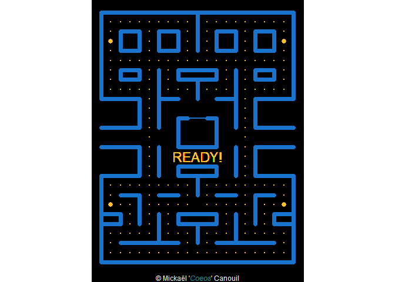<!-- -->

3.  Draw the `"eaten"` bonus points geometry.

``` r
p_points <- list(
  geom_point(
    data = bonus_points_eaten,
    mapping = aes(x = x, y = y, colour = colour, size = colour, group = step),
    inherit.aes = FALSE
  )
)
```

``` r
base_grid + p_points
```

<!-- -->

4.  Draw the main character (I am talking about Pac-Man …)

``` r
p_pacman <- list(
  geom_arc_bar(
    data = pacman_moves,
    mapping = aes(
      x0 = x, y0 = y,
      r0 = 0, r = 0.5,
      start = start, end = end,
      colour = colour, fill = colour,
      group = step
    ),
    inherit.aes = FALSE
  )
)
```

``` r
base_grid + p_pacman
```

<!-- -->

5.  Draw the ghosts, using the trick that `+` works also on a list of
    geometries.

``` r
p_ghosts <- map(.x = ghosts, .f = function(data) {
  ghost_moves <- compute_ghost_status(
    ghost = data,
    pacman_moves = pacman_moves,
    bonus_points_eaten = bonus_points_eaten
  )
  list(
    geom_polygon(
      data = unnest(ghost_moves, "body"),
      mapping = aes(
        x = x, y = y,
        fill = colour, colour = colour,
        group = step
      ),
      inherit.aes = FALSE
    ),
    geom_circle(
      data = unnest(ghost_moves, "eyes"),
      mapping = aes(
        x0 = x0, y0 = y0,
        r = r,
        colour = part, fill = part,
        group = step
      ),
      inherit.aes = FALSE
    )
  )
})
```

``` r
base_grid + p_ghosts
```

<!-- -->

6.  Draw everything.

``` r
base_grid + p_points + p_pacman + p_ghosts
```

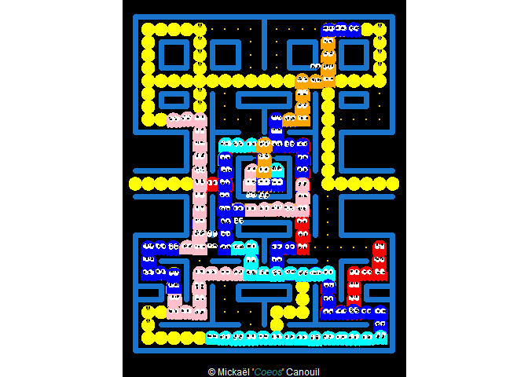<!-- -->

7.  Animate everything.

``` r
PacMan <- base_grid + p_points + p_pacman + p_ghosts + transition_manual(step)
```

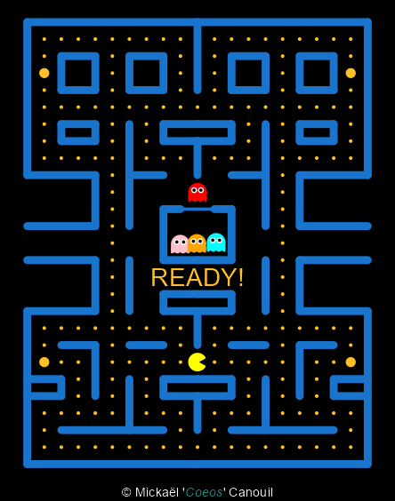<!-- -->

## Getting help

If you encounter a clear bug, please file a minimal reproducible example
on [github](https://github.com/mcanouil/ggpacman/issues). For questions
and other discussion, please contact the package maintainer.

------------------------------------------------------------------------

Please note that this project is released with a [Contributor Code of
Conduct](https://github.com/mcanouil/ggpacman/blob/master/.github/CODE_OF_CONDUCT.md).
participating in this project you agree to abide by its terms.
