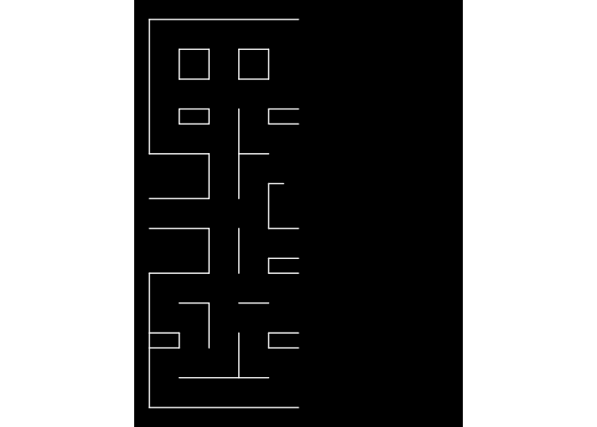

<!-- README.md is generated from README.Rmd. Please edit that file -->

# A `ggplot2` and `gganimate` Version of Pac-Man

<!-- badges: start -->

[](https://www.tidyverse.org/lifecycle/#maturing)
[](https://github.com/mcanouil/ggpacman)
[](https://cran.r-project.org/package=ggpacman)
[](https://cran.r-project.org/web/checks/check_results_ggpacman.html)
[](https://cran.r-project.org/package=ggpacman)
[](https://github.com/mcanouil/ggpacman/actions)
<!-- badges: end -->

The goal of pacman is to …  
Build a GIF of the game Pac-Man (*not to develop R version of Pac-Man*)
…

## Installation

``` r
# Install ggpacman from CRAN:
install.packages("ggpacman")

# Or the the development version from GitHub:
# install.packages("remotes")
remotes::install_github("mcanouil/ggpacman")
```

## Pac-Man in action

``` r
library(ggpacman)
animate_pacman(
  pacman = pacman,
  ghosts = list(blinky, pinky, inky, clyde),
  font_family = "xkcd"
)
```

## The Story of `ggpacman`

It started on a Saturday evening …

It was the 21<sup>st</sup> of March (*for the sake of precision*),
around 10 pm CET (*also for the sake of precision and mostly because it
is not relevant*). I was playing around with my data on ‘all’ the movies
I have seen so far
([mcanouil/IMDbRating](https://github.com/mcanouil/IMDbRating)) and
looking on possibly new ideas of visualisation on twitter using
`#ggplot2` and `#gganimate` (by the way the first time I played with
[`gganimate`](https://gganimate.com/) was at [useR-2018 (Brisbane,
Australia)](https://www.r-project.org/conferences/useR-2018/), just
before and when @thomasp85 released the actual framework). The only
thing on the feed was “contaminated/deaths and covid-19” curves made
with [`ggplot2`](https://ggplot2.tidyverse.org/) and a few with
[`gganimate`](https://gganimate.com/) … Let’s say, it was not as funny
and interesting as I was hoping for … Then, I’ve got an idea, what if I
can do something funny and not expected with
[`ggplot2`](https://ggplot2.tidyverse.org/) and
[`gganimate`](https://gganimate.com/)? My first thought, was let’s draw
and animate Pac-Man, that should not be that hard\!

Well, it was not that easy after-all … But, I am going to go through my
code here (you might be interested to actually look at the [commits
history](https://github.com/mcanouil/ggpacman/commits/master).

### The packages

``` r
library("stats")
library("utils")
library("rlang")
library("magrittr")
library("dplyr")
library("tidyr")
library("purrr")
library("ggplot2")
library("ggforce")
library("gganimate")
library("ggtext")
```

### The maze layer

#### The base layer

First thing first, I needed to set-up the base layer, meaning, the maze
from Pac-Man.  
I did start by setting the coordinates of the maze.

``` r
base_layer <- ggplot() +
  theme_void() +
  theme(
    legend.position = "none",
    plot.background = element_rect(fill = "black", colour = "black"),
    panel.background = element_rect(fill = "black", colour = "black"),
  ) +
  coord_fixed(xlim = c(0, 20), ylim = c(0, 26))
```

For later use, let’s add some scales (actually those scales, where
defined way after chronologically speaking). I am using those to define
size and colours for all the `geom_*()` I am going to use to achieve the
Pac-Man GIF.

``` r
map_colours <- c(
  "READY!" = "goldenrod1",
  "wall" = "dodgerblue3", "door" = "dodgerblue3",
  "normal" = "goldenrod1", "big" = "goldenrod1", "eaten" = "black",
  "Pac-Man" = "yellow",
  "eye" = "white", "iris" = "black",
  "Blinky" = "red", "Blinky_weak" = "blue", "Blinky_eaten" = "transparent",
  "Pinky" = "pink", "Pinky_weak" = "blue", "Pinky_eaten" = "transparent",
  "Inky" = "cyan", "Inky_weak" = "blue", "Inky_eaten" = "transparent",
  "Clyde" = "orange", "Clyde_weak" = "blue", "Clyde_eaten" = "transparent"
)
```

``` r
base_layer <- base_layer +
  scale_size_manual(values = c("wall" = 2.5, "door" = 1, "big" = 2.5, "normal" = 0.5, "eaten" = 3)) +
  scale_fill_manual(breaks = names(map_colours), values = map_colours) +
  scale_colour_manual(breaks = names(map_colours), values = map_colours) 
```

My `base_layer` here is not really helpful, so I temporarily added some
elements to help me draw everything.  
*Note*: I won’t use it in the following.

``` r
base_layer +
  scale_x_continuous(breaks = 0:21, sec.axis = dup_axis()) +
  scale_y_continuous(breaks = 0:26, sec.axis = dup_axis()) +
  theme(
    panel.grid.major = element_line(colour = "white"), 
    axis.text = element_text(colour = "white")
  ) +
  annotate("rect", xmin = 0, xmax = 21, ymin = 0, ymax = 26, fill = NA)
```

<!-- -->

Quite better, isn’t it?\!

#### The grid layer

I started drawing the vertical lines on the left (as you may have
noticed, the first level is symmetrical).

``` r
left_vertical_segments <- tribble(
  ~x, ~y, ~xend, ~yend,
  0, 0, 0, 9,
  0, 17, 0, 26,
  2, 4, 2, 5,
  2, 19, 2, 20,
  2, 22, 2, 24,
  4, 4, 4, 7,
  4, 9, 4, 12,
  4, 14, 4, 17,
  4, 19, 4, 20,
  4, 22, 4, 24,
  6, 2, 6, 5,
  6, 9, 6, 12,
  6, 14, 6, 20,
  6, 22, 6, 24,
  8, 4, 8, 5,
  8, 9, 8, 10,
  8, 12, 8, 15,
  8, 19, 8, 20,
  8, 22, 8, 24
)
```

``` r
base_layer + 
  geom_segment(
    data = left_vertical_segments,
    mapping = aes(x = x, y = y, xend = xend, yend = yend),
    lineend = "round",
    inherit.aes = FALSE,
    colour = "white"
  )
```

<!-- -->

Let’s add the horizontal lines (still on the left side of the maze)\!

``` r
left_horizontal_segments <- tribble(
  ~x, ~y, ~xend, ~yend,
  0, 0, 10, 0,
  2, 2, 8, 2,
  0, 4, 2, 4,
  8, 4, 10, 4,
  0, 5, 2, 5,
  8, 5, 10, 5,
  2, 7, 4, 7,
  6, 7, 8, 7,
  0, 9, 4, 9,
  8, 9, 10, 9,
  8, 10, 10, 10,
  0, 12, 4, 12,
  8, 12, 10, 12,
  0, 14, 4, 14,
  8, 15, 9, 15,
  0, 17, 4, 17,
  6, 17, 8, 17,
  2, 19, 4, 19,
  8, 19, 10, 19,
  2, 20, 4, 20,
  8, 20, 10, 20,
  2, 22, 4, 22,
  6, 22, 8, 22,
  2, 24, 4, 24,
  6, 24, 8, 24,
  0, 26, 10, 26
)

left_segments <- bind_rows(left_vertical_segments, left_horizontal_segments)
```

``` r
base_layer + 
  geom_segment(
    data = left_segments,
    mapping = aes(x = x, y = y, xend = xend, yend = yend),
    lineend = "round",
    inherit.aes = FALSE,
    colour = "white"
  )
```

<!-- -->

Now, we can see the maze. As I said earlier, the first level is
symmetrical, let’s use `left_segments` to compute a `right_segments`.

``` r
right_segments <-  mutate(
  .data = left_segments,
  x = abs(x - 20),
  xend = abs(xend - 20)
)
```

``` r
base_layer + 
  geom_segment(
    data = bind_rows(left_segments, right_segments),
    mapping = aes(x = x, y = y, xend = xend, yend = yend),
    lineend = "round",
    inherit.aes = FALSE,
    colour = "white"
  )
```

<!-- -->

Now, let’s add the missing vertical lines in the middle and the ghost
“house” door.

``` r
centre_vertical_segments <- tribble(
  ~x, ~y, ~xend, ~yend,
  10, 2, 10, 4,
  10, 7, 10, 9,
  10, 17, 10, 19,
  10, 22, 10, 26
)
door_segment <- tibble(x = 9, y = 15, xend = 11, yend = 15, type = "door")
```

Combine all the segments and draw them all.

``` r
maze_walls <- bind_rows(
  left_segments,
  centre_vertical_segments,
  right_segments
) %>%
  mutate(type = "wall") %>%
  bind_rows(door_segment)
```

``` r
base_layer + 
  geom_segment(
    data = maze_walls,
    mapping = aes(x = x, y = y, xend = xend, yend = yend),
    lineend = "round",
    inherit.aes = FALSE,
    colour = "white"
  )
```

<!-- -->

The maze is complete, but no-one can actually see the door, since it
appears the same way at the walls. You may have noticed, I added a
column `type`, which can hold two values: `wall` and `door`. I am going
to use that as an aesthetic, you may already have guessed which ones.  
The answer is the `colour` and `size` aesthetics.

``` r
base_layer + 
  geom_segment(
    data = maze_walls,
    mapping = aes(x = x, y = y, xend = xend, yend = yend, colour = type, size = type),
    lineend = "round",
    inherit.aes = FALSE
  )
```

<!-- -->

*Note: `maze_walls` is a dataset of `ggpacman` (`data("maze_walls",
package = "ggpacman")`).*

#### The bonus points layer

The strategy was quite the same as for the grid layer:

  - Setting up the point coordinates for the left side and the middle.
  - Compute the coordinates for the right side.
  - Use a column `type` for the two types of bonus points, *i.e.*,
    `"normal"` and `"big"` (the one who weaken the ghosts).

<!-- end list -->

``` r
bonus_points_coord <- function() {
  left_bonus_points <- tribble(
    ~x, ~y, ~type,
    1, c(1:3, 7:8, 18:22, 24:25), "normal",
    1, c(6, 23), "big",
    2, c(1, 3, 6, 8, 18, 21, 25), "normal",
    3, c(1, 3:6, 8, 18, 21, 25), "normal",
    4, c(1, 3, 8, 18, 21, 25), "normal",
    5, c(1, 3:25), "normal",
    6, c(1, 6, 8, 21, 25), "normal",
    7, c(1, 3:6, 8, 18:21, 25), "normal",
    8, c(1, 3, 6, 8, 18, 21, 25), "normal",
    9, c(1:3, 6:8, 18, 21:25), "normal"
  )

  bind_rows(
    left_bonus_points,
    tribble(
      ~x, ~y, ~type,
      10, c(1, 21), "normal"
    ),
    mutate(left_bonus_points, x = abs(x - 20))
  ) %>%
    unnest("y")
}
maze_points <- bonus_points_coord()
```

``` r
maze_layer <- base_layer + 
  geom_segment(
    data = maze_walls,
    mapping = aes(x = x, y = y, xend = xend, yend = yend, colour = type, size = type),
    lineend = "round",
    inherit.aes = FALSE
  ) +
  geom_point(
    data = maze_points,
    mapping = aes(x = x, y = y, size = type, colour = type),
    inherit.aes = FALSE
  )
maze_layer
```

<!-- -->

*Note: `maze_points` is a dataset of `ggpacman` (`data("maze_points",
package = "ggpacman")`).*

### Pac-Man character

Time to draw the main character. To drax Pac-Man, I needed few things
first:

  - Pac-Man moves, *i.e.*, all the coordinates where Pac-Man is supposed
    to be at every step.
    
    ``` r
    data("pacman", package = "ggpacman")
    unnest(pacman, c("x", "y"))
    #> # A tibble: 150 x 3
    #>        x     y colour 
    #>    <dbl> <dbl> <chr>  
    #>  1    10     6 Pac-Man
    #>  2    10     6 Pac-Man
    #>  3    10     6 Pac-Man
    #>  4    10     6 Pac-Man
    #>  5    10     6 Pac-Man
    #>  6    10     6 Pac-Man
    #>  7    10     6 Pac-Man
    #>  8    10     6 Pac-Man
    #>  9    10     6 Pac-Man
    #> 10    10     6 Pac-Man
    #> # … with 140 more rows
    ```
    
    ``` r
    maze_layer +
      geom_point(
        data = unnest(pacman, c("x", "y")), 
        mapping = aes(x = x, y = y, colour = colour),
        size = 4
      )
    ```
    
    <!-- -->

  - Pac-Man shape (open and closed mouth). Since, Pac-Man is not a
    complete circle shape, I used `geom_arc_bar()`, and defined the
    properties of each state of Pac-Man based on the aesthetics required
    by it. *Note*: At first, I wanted a smooth animation/transition of
    Pac-Man opening and closing its mouth, this is why there are four
    `"close_"` states.
    
    ``` r
    pacman_state <- tribble(
      ~state, ~start, ~end,
      "open_right", 14 / 6 * pi, 4 / 6 * pi,
      "close_right", 15 / 6 * pi, 3 / 6 * pi,
      "open_up", 11 / 6 * pi, 1 / 6 * pi,
      "close_up", 12 / 3 * pi, 0 / 6 * pi,
      "open_left", 8 / 6 * pi, - 2 / 6 * pi,
      "close_left", 9 / 6 * pi, - 3 / 6 * pi,
      "open_down", 5 / 6 * pi, - 5 / 6 * pi,
      "close_down", pi, - pi
    )
    ```
    
    ``` r
    ggplot() +
      geom_arc_bar(
        data = pacman_state,
        mapping = aes(
          x0 = 0, y0 = 0,
          r0 = 0, r = 0.5,
          start = start, end = end
        ),
        fill = "yellow",
        inherit.aes = FALSE
      ) +
      facet_wrap(vars(state), ncol = 4)
    ```
    
    <!-- -->

<!-- <blockquote class="twitter-tweet"><p lang="en" dir="ltr">Next mission, should you choose to accept, is to make Pac-Man face the direction of movement🎖</p>&mdash; Thomas Lin Pedersen (@thomasp85) <a href="https://twitter.com/thomasp85/status/1241767912370774020?ref_src=twsrc%5Etfw">March 22, 2020</a></blockquote> <script async src="https://platform.twitter.com/widgets.js" charset="utf-8"></script> -->

Once those things available, how to make Pac-Man looks where he is
headed?  
Short answer, I just computed the differences between two successive
positions of Pac-Man and added both open/close state to a new column
`state`.

``` r
pacman %>%
  unnest(c("x", "y")) %>%
  mutate(
    state_x = sign(x - lag(x)),
    state_y = sign(y - lag(y)),
    state = case_when(
      (is.na(state_x) | state_x %in% 0) &
        (is.na(state_y) | state_y %in% 0) ~ list(c("open_right", "close_right")),
      state_x == 1 & state_y == 0 ~ list(c("open_right", "close_right")),
      state_x == -1 & state_y == 0 ~ list(c("open_left", "close_left")),
      state_x == 0 & state_y == -1 ~ list(c("open_down", "close_down")),
      state_x == 0 & state_y == 1 ~ list(c("open_up", "close_up"))
    )
  )  %>%
  unnest("state")
#> # A tibble: 300 x 6
#>        x     y colour  state_x state_y state      
#>    <dbl> <dbl> <chr>     <dbl>   <dbl> <chr>      
#>  1    10     6 Pac-Man      NA      NA open_right 
#>  2    10     6 Pac-Man      NA      NA close_right
#>  3    10     6 Pac-Man       0       0 open_right 
#>  4    10     6 Pac-Man       0       0 close_right
#>  5    10     6 Pac-Man       0       0 open_right 
#>  6    10     6 Pac-Man       0       0 close_right
#>  7    10     6 Pac-Man       0       0 open_right 
#>  8    10     6 Pac-Man       0       0 close_right
#>  9    10     6 Pac-Man       0       0 open_right 
#> 10    10     6 Pac-Man       0       0 close_right
#> # … with 290 more rows
```

Here, in preparation for [`gganimate`](https://gganimate.com/), I also
added a column `step` before merging the new upgraded `pacman` with the
Pac-Man `state` column with the `pacman_state` defined earlier.

``` r
compute_pacman_coord <- function(data) {
  pacman_state <- tribble(
    ~state, ~start, ~end,
    "open_right", 14 / 6 * pi, 4 / 6 * pi,
    "close_right", 15 / 6 * pi, 3 / 6 * pi,
    "open_up", 11 / 6 * pi, 1 / 6 * pi,
    "close_up", 12 / 3 * pi, 0 / 6 * pi,
    "open_left", 8 / 6 * pi, - 2 / 6 * pi,
    "close_left", 9 / 6 * pi, - 3 / 6 * pi,
    "open_down", 5 / 6 * pi, - 5 / 6 * pi,
    "close_down", pi, - pi
  )

  data  %>%
    unnest(c("x", "y")) %>%
    mutate(
      state_x = sign(x - lag(x)),
      state_y = sign(y - lag(y)),
      state = case_when(
        (is.na(state_x) | state_x %in% 0) &
          (is.na(state_y) | state_y %in% 0) ~ list(c("open_right", "close_right")),
        state_x == 1 & state_y == 0 ~ list(c("open_right", "close_right")),
        state_x == -1 & state_y == 0 ~ list(c("open_left", "close_left")),
        state_x == 0 & state_y == -1 ~ list(c("open_down", "close_down")),
        state_x == 0 & state_y == 1 ~ list(c("open_up", "close_up"))
      )
    )  %>%
    unnest("state") %>%
    mutate(step = 1:n()) %>%
    left_join(y = pacman_state, by = "state")
}
pacman_moves <- compute_pacman_coord(pacman)
pacman_moves
#> # A tibble: 300 x 9
#>        x     y colour  state_x state_y state        step start   end
#>    <dbl> <dbl> <chr>     <dbl>   <dbl> <chr>       <int> <dbl> <dbl>
#>  1    10     6 Pac-Man      NA      NA open_right      1  7.33  2.09
#>  2    10     6 Pac-Man      NA      NA close_right     2  7.85  1.57
#>  3    10     6 Pac-Man       0       0 open_right      3  7.33  2.09
#>  4    10     6 Pac-Man       0       0 close_right     4  7.85  1.57
#>  5    10     6 Pac-Man       0       0 open_right      5  7.33  2.09
#>  6    10     6 Pac-Man       0       0 close_right     6  7.85  1.57
#>  7    10     6 Pac-Man       0       0 open_right      7  7.33  2.09
#>  8    10     6 Pac-Man       0       0 close_right     8  7.85  1.57
#>  9    10     6 Pac-Man       0       0 open_right      9  7.33  2.09
#> 10    10     6 Pac-Man       0       0 close_right    10  7.85  1.57
#> # … with 290 more rows
```

``` r
maze_layer +
  geom_arc_bar(
    data = pacman_moves,
    mapping = aes(
      x0 = x, y0 = y,
      r0 = 0, r = 0.5,
      start = start, end = end,
      colour = colour, fill = colour,
      group = step
    ),
    inherit.aes = FALSE
  )
```

<!-- -->

We can’t see much, right?  
Ok, perhaps it’s time to use [`gganimate`](https://gganimate.com/).  
I am going to animate Pac-Man based on the column `step`, which is, if
you looked at the code above, just the line number of `pacman_moves`.

``` r
animated_pacman <- maze_layer +
  geom_arc_bar(
    data = pacman_moves,
    mapping = aes(
      x0 = x, y0 = y,
      r0 = 0, r = 0.5,
      start = start, end = end,
      colour = colour, fill = colour,
      group = step
    ),
    inherit.aes = FALSE
  ) + 
  transition_manual(step)
```

<!-- -->

*Note: `pacman` is a dataset of `ggpacman` (`data("pacman", package =
"ggpacman")`).*

### The Ghosts character (Blinky, Pinky, Inky and Clyde)

#### Body

``` r
ghost_arc <- unnest(tribble(
  ~x0, ~y0, ~r, ~start, ~end, ~part,
  0, 0, 0.5, - 1 * pi / 2, 1 * pi / 2, "top",
  c(-1 / 6, 1 / 6), -0.5 + 1/8, 0.125, pi / 2, 3 * pi / 2, "bottom",
  -0.5, -0.5 + 1/8, 0.125, 2 * pi / 4, 4 * pi / 4, "bottom",
  0.5, -0.5 + 1/8, 0.125, - 2 * pi / 4, - 4 * pi / 4, "bottom",
  c(-1 / 3, 0, 1 / 3), -0.5 + 1/8, 1 / 24, - 1 * pi / 2, 1 * pi / 2, "bottom",
), "x0")

top <- ggplot() +
  geom_arc_bar(
    data = ghost_arc[1, ],
    mapping = aes(x0 = x0, y0 = y0, r0 = 0, r = r, start = start, end = end)
  ) +
  coord_fixed(xlim = c(-1, 1), ylim = c(-1, 1))
```

``` r
top
```

<!-- -->

``` r
top_polygon <- ggplot_build(top)$data[[1]][, c("x", "y")]
```

``` r
bottom <- ggplot() +
  geom_arc_bar(
    data = ghost_arc[c(5, 3, 2, 4), ],
    mapping = aes(
      x0 = .data[["x0"]], y0 = .data[["y0"]],
      r0 = 0, r = 0.17,
      start = .data[["start"]], end = .data[["end"]]
    )
  ) +
  coord_fixed(xlim = c(-1, 1), ylim = c(-1, 1))
```

``` r
bottom
```

<!-- -->

``` r
bottom_polygon <- ggplot_build(bottom)$data[[1]][, c("x", "y")]
```

``` r
ghost_body <- bind_rows(
  top_polygon[-nrow(top_polygon), ],
  tibble(x = 0.5, y = -0.5 + 1/8),
  bottom_polygon
)
```

``` r
ggplot() +
  coord_fixed(xlim = c(-1, 1), ylim = c(-1, 1)) +
  geom_polygon(
    data = ghost_body,
    mapping = aes(x = x, y = y),
    inherit.aes = FALSE
  )
```

<!-- -->

*Note: `ghost_body` is a dataset of `ggpacman` (`data("ghost_body",
package = "ggpacman")`).*

#### Eyes

``` r
ghost_eyes <- tribble(
  ~x0, ~y0, ~r, ~part, ~direction,
  1/5, 1/8, 1/8, "eye", c("up", "down", "right", "left", "middle"),
  -1/5, 1/8, 1/8, "eye", c("up", "down", "right", "left", "middle"),
  5/20, 1/8, 1/20, "iris", "right",
  -3/20, 1/8, 1/20, "iris", "right",
  1/5, 1/16, 1/20, "iris", "down",
  -1/5, 1/16, 1/20, "iris", "down",
  3/20, 1/8, 1/20, "iris", "left",
  -5/20, 1/8, 1/20, "iris", "left",
  1/5, 3/16, 1/20, "iris", "up",
  -1/5, 3/16, 1/20, "iris", "up",
  1/5, 1/8, 1/20, "iris", "middle",
  -1/5, 1/8, 1/20, "iris", "middle"
) %>%
  unnest("direction")
```

``` r
map_colours <- c("eye" = "white", "iris" = "black")
ggplot() +
  coord_fixed(xlim = c(-0.5, 0.5), ylim = c(-0.5, 0.5)) +
  scale_fill_manual(breaks = names(map_colours), values = map_colours) +
  scale_colour_manual(breaks = names(map_colours), values = map_colours) +
  geom_circle(
    data = ghost_eyes,
    mapping = aes(x0 = x0, y0 = y0, r = r, colour = part, fill = part),
    inherit.aes = FALSE,
    show.legend = FALSE
  ) +
  facet_wrap(vars(direction), ncol = 3)
```

<!-- -->

*Note: `ghost_eyes` is a dataset of `ggpacman` (`data("ghost_eyes",
package = "ggpacman")`).*

#### Ghost shape

``` r
map_colours <- c("eye" = "white", "iris" = "black")
ggplot() +
  coord_fixed(xlim = c(-1, 1), ylim = c(-1, 1)) +
  scale_fill_manual(breaks = names(map_colours), values = map_colours) +
  scale_colour_manual(breaks = names(map_colours), values = map_colours) +
  geom_polygon(
    data = get(data("ghost_body", package = "ggpacman")),
    mapping = aes(x = x, y = y),
    inherit.aes = FALSE
  ) +
  geom_circle(
    data = get(data("ghost_eyes", package = "ggpacman")),
    mapping = aes(x0 = x0, y0 = y0, r = r, colour = part, fill = part),
    inherit.aes = FALSE,
    show.legend = FALSE
  ) +
  facet_wrap(vars(direction), ncol = 3)
```

<!-- -->

## Getting help

If you encounter a clear bug, please file a minimal reproducible example
on [github](https://github.com/mcanouil/ggpacman/issues).  
For questions and other discussion, please contact the package
maintainer.

-----

Please note that this project is released with a [Contributor Code of
Conduct](https://github.com/mcanouil/ggpacman/blob/master/.github/CODE_OF_CONDUCT.md).  
By participating in this project you agree to abide by its terms.
