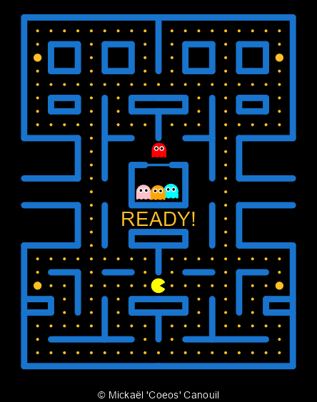

<!-- README.md is generated from README.Rmd. Please edit that file -->

# A `ggplot2` and `gganimate` Version of Pac-Man

<!-- badges: start -->

<!-- badges: end -->

The goal of pacman is to …

``` r
library(pacman)
animate_pacman(
  pacman = pacman(),
  ghosts = list(blinky(), pinky(), inky(), clyde()),
  font_family = "xkcd"
)
```

<!-- -->
